# Spread 1.0.0 — tam sürüm (ürünleştirme)

**Mantık değişmedi.** Bütün güvenlik kilitleri, tick düzeyinde doğrulamalar, kırpma kalibrasyonu ve yedek sequence v0.3.4'teki gibi.
Bu sürümde yalnız arayüz, kurulum ve paketleme değişti.

**Açık risk:** kırpma kalibrasyonu gerçek Premiere'de ilk BAĞLA'da ölçülecek. Tutarlı bir kural çıkmazsa BAĞLA hiçbir şey kesmeden
durur ve bunu tek cümleyle söyler.

## Kurulum

`Spread_Kurulum_v1.0.0.zip` → çıkart → **KUR.cmd** (yönetici izni gerekmez) → Premiere'i yeniden başlat →
**Window → Extensions (Legacy) → Spread Helper** (küçük panel, açık bırak) → **Window → UXP Plugins → Spread**.
Kaldırmak: **KALDIR.cmd** (PlayerDebugMode dahil her şeyi kurulum öncesine döndürür). Ayrıntı: `OKU_BENI.txt`, `KURULUM_TR.md`.

## Yenilikler

- **Sade panel:**
  - Üstte sequence adı ve yardımcı göstergesi (● hazır / ● kapalı).
  - Numaralı üç adım, büyük düğmeler. Biten adımda ✓ ve kısa sonuç; sıradaki adım vurgulu.
  - İşlem sırasında ilerleme çubuğu. Sonuç tek cümle; teknik ayrıntı "Ayrıntı ▸" altında.
  - Onay penceresi 3–5 satırlık özet; dikkat gerektiren satırlar sarı.
  - "Gelişmiş ▸" altında kaynak eşleme, eşik, boşluk, Durum raporu ve günlük.
- **Sorun bildir:** tek bir metin paketi hazırlar (sürümler, Durum raporu, son TOPLA/BAĞLA günlükleri, kalibrasyon sonucu, yardımcı
  durumu, son hata). Panoya kopyalar ve masaüstüne `SpreadRapor_<tarih>.txt` olarak kaydeder. Ayrıntılı günlük her zaman arka planda
  tutulur (bellek + dosya).
- **Spread Helper:** tek durum satırı. Köprüsüz BAĞLA bölümü yalnız Spread "yardımcı panelinden bağla" dediğinde görünür.
- **Tek tık kurulum:** `KUR.cmd` / `KALDIR.cmd` / `OKU_BENI.txt`. Probe yayından çıkarıldı (repoda duruyor).

## Ekran görüntüleri (mock ortamı, 300 px ve 560 px panel)

Mock ortamı: jsdom'da gerçek panel HTML'i + sahte Premiere + gerçek yardımcı sunucusu; Chromium'da çizildi. Premiere'de düğmeler
Spectrum stilinde çizilir.

| Hazır (sıradaki: TOPLA) | TOPLA onayı (çift kopya uyarısı) | TOPLA sürerken |
|---|---|---|
| 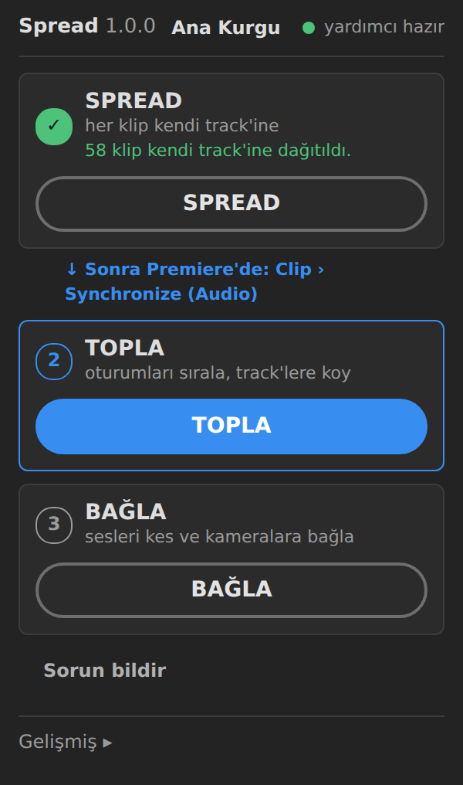 | 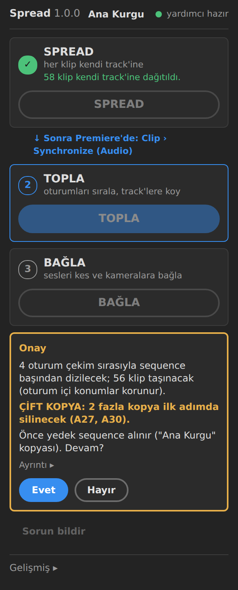 | 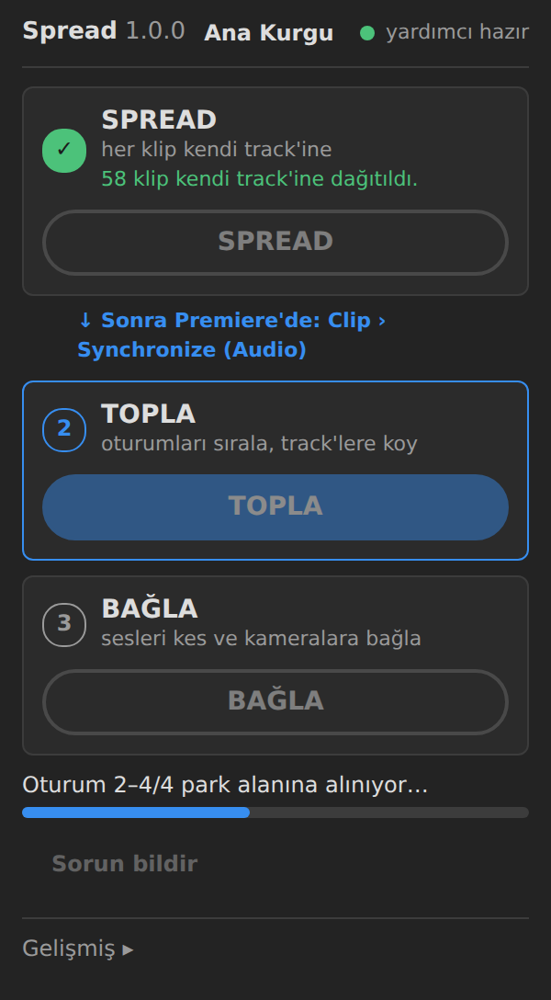 |

| TOPLA bitti | BAĞLA onayı | Kırpma ölçülürken |
|---|---|---|
| 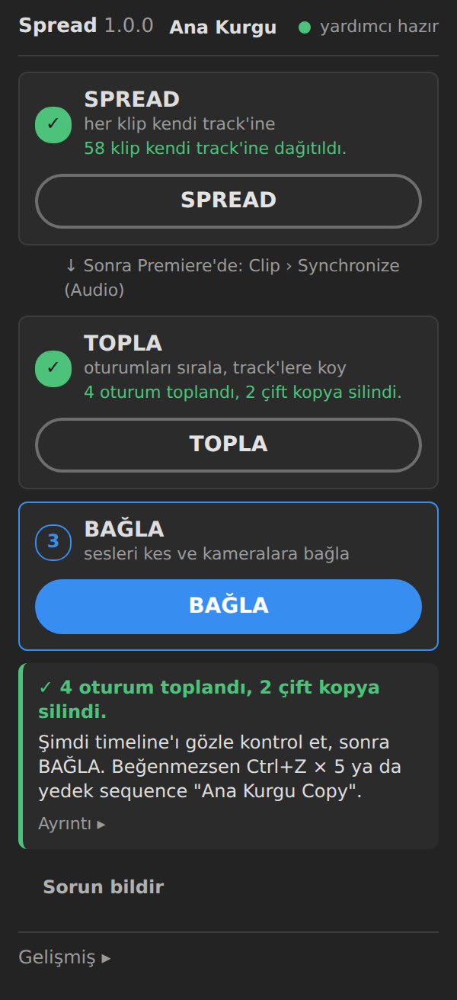 | 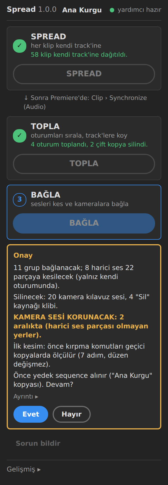 | 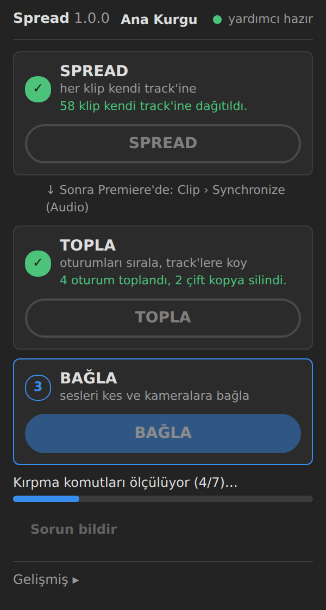 |

| BAĞLA bitti | Hata (tek cümle) | Hata — Ayrıntı ▸ |
|---|---|---|
| 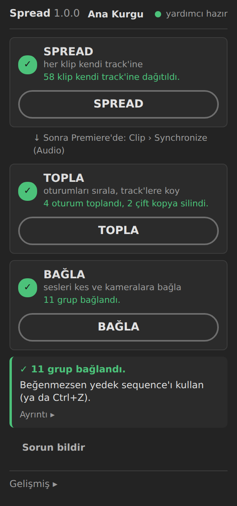 | 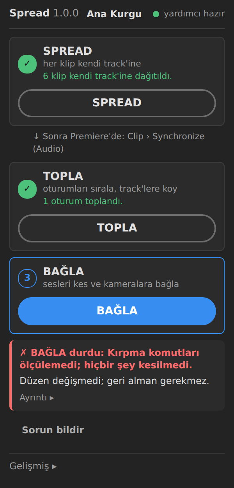 | 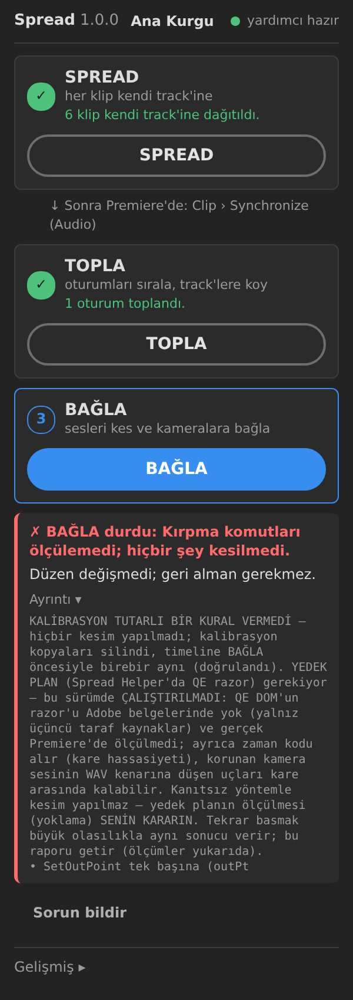 |

| Gelişmiş ▸ + Sorun bildir | Yardımcı kapalı |
|---|---|
| 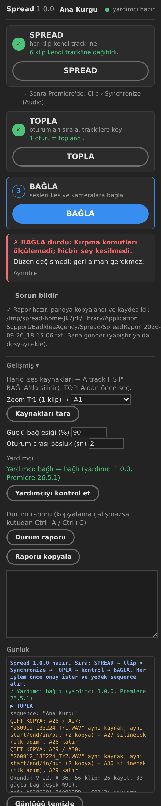 | 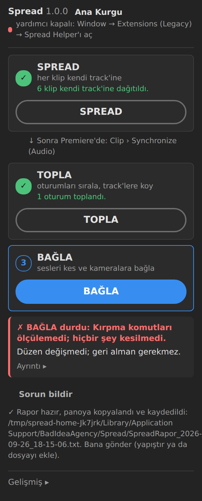 |

Geniş panel:

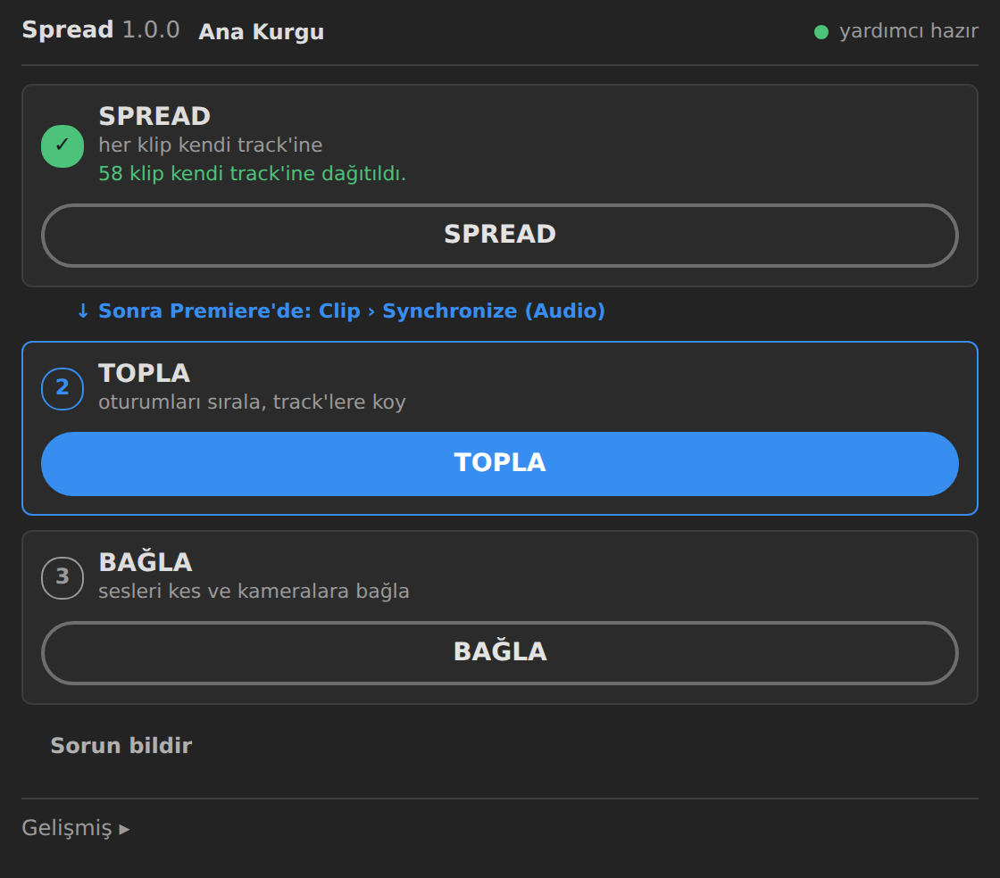
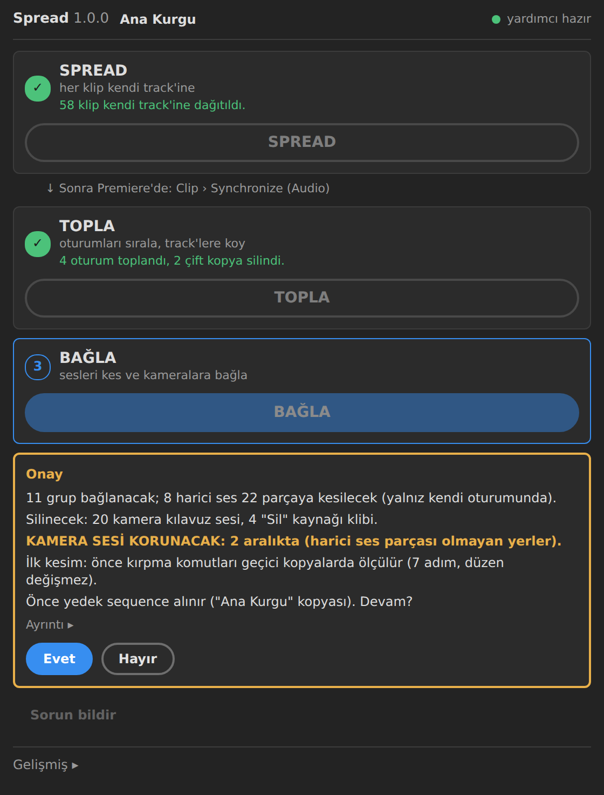
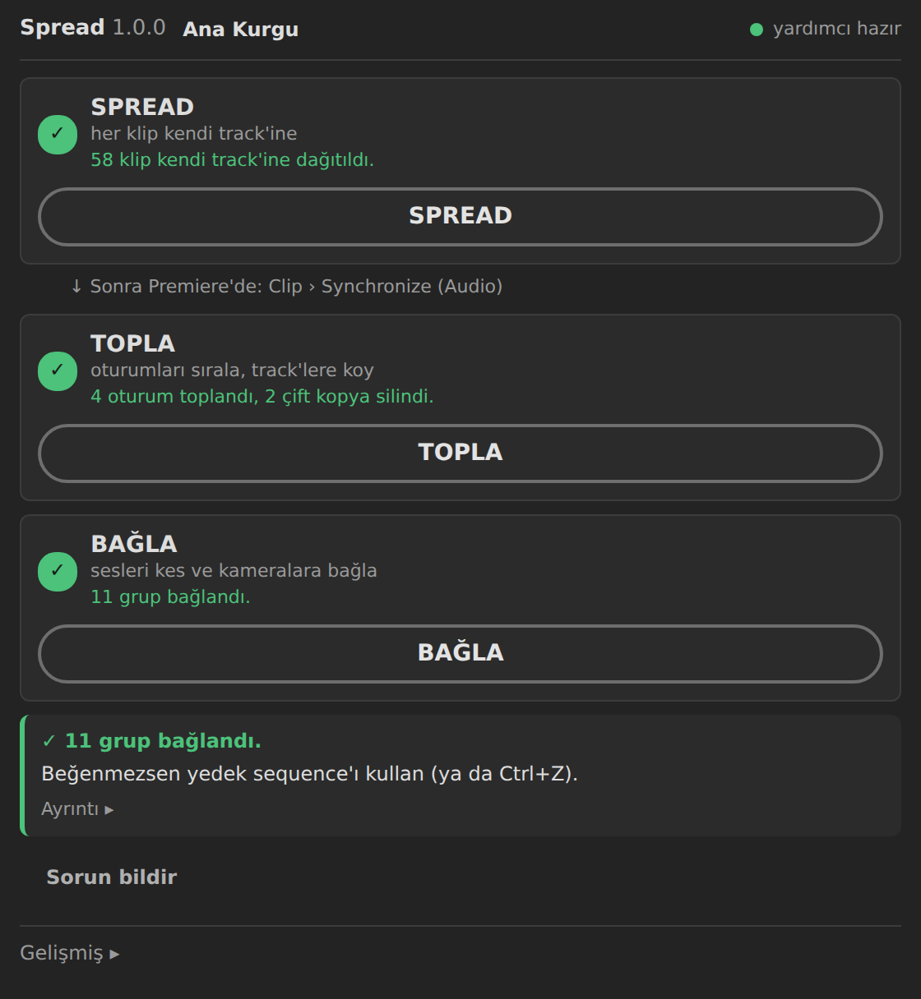

Spread Helper:

| Çalışıyor | BAĞLA bekliyor | Hata |
|---|---|---|
| 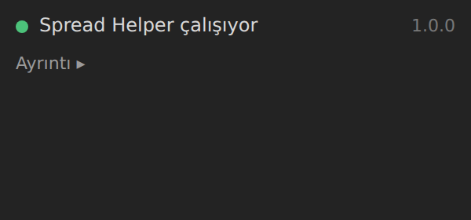 | 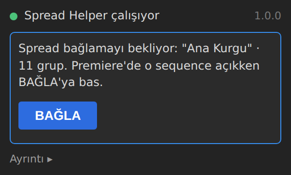 | 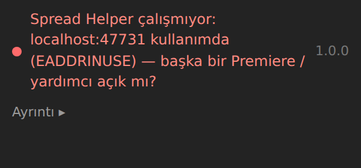 |

## Doğrulama

- Bütün mock senaryoları değişmeden geçer (mantık değişmediğinin kanıtı).
- Regresyon: v0.3.3 kırpması gerçek set anlamında düşer, güncel kod geçer.
- KUR.cmd / KALDIR.cmd Wine'da sınandı (`scripts/test-kurulum-wine.sh`):
  - yalnız HKCU ve %APPDATA%'ya yazılır;
  - KALDIR PlayerDebugMode'u kurulum öncesi değerlerine döndürür;
  - yönetici olarak çalıştırılınca hiçbir şey yazılmaz.
