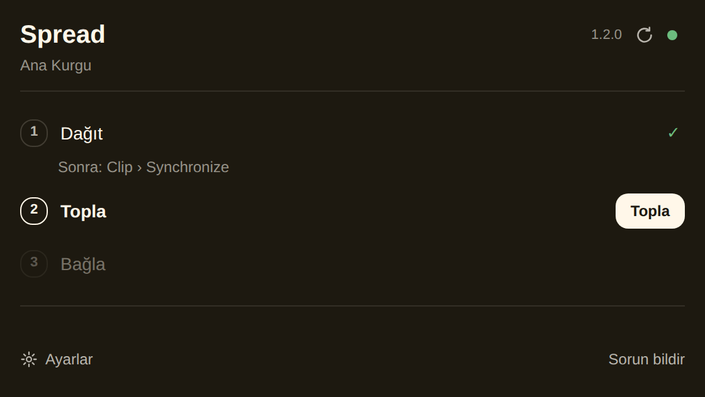
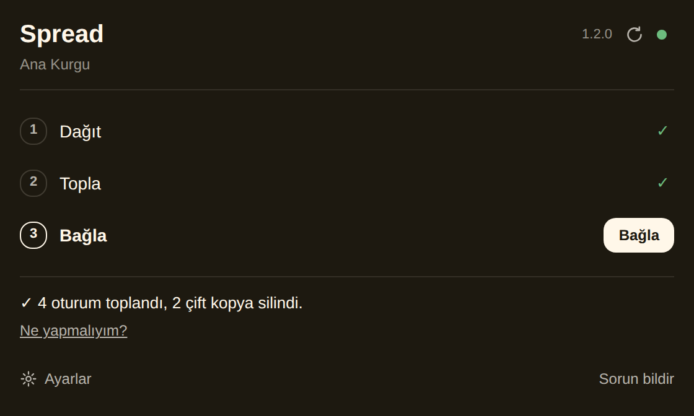
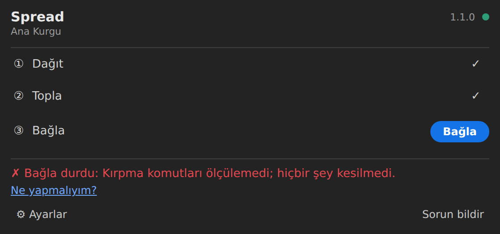

# Spread 1.1.0 — bağlama düzeltmesi + sade arayüz

## Bağlama (karışık kanal tipi)

Gerçek Premiere 26.5.1'de (v1.0.0) kesme / silme tick düzeyinde doğruydu, kırpma kalibrasyonu kanıtlandı (kuyruk = SetOutPoint,
baş = SetInPoint), ama `linkSelection()` 11/11 grupta reddetti. Neden: Premiere bir bağda **farklı kanal tipindeki sesleri kabul
etmiyor** (Adobe: bağdaki bütün ses klipleri aynı kanal tipinde olmalı) — mono Zoom Tr1/Tr2 + stereo TrLR / kamera sesi.

- **Zoom TrLR varsayılan "Sil"** (seçim yapmadıysan; ⚙ Ayarlar'dan değiştirilebilir). 1.0.0'dan yükseltmede kayıtlı TrLR seçimi
  bir kez "Sil"e çevrilir.
- Bağla onayında bir grupta mono + stereo varsa tek satır: **"KARIŞIK KANAL: N grupta mono + stereo…"**.
- Premiere grubu reddederse yardımcı **farklı kanal tipindeki sesleri çıkarıp grubu yeniden bağlar**. Çıkarılanlar **bağ dışında,
  yerinde** kalır — **hiçbir klip silinmez**; sonuçta "N ses bağ dışında kaldı". Korunan (stereo) kamera sesi parçası da buna dahil
  (tek kanala çevirmenin belgelenmiş yolu yok).
- **Yalnız bağla:** kesimden sonra bir parçayı elle sildiysen Bağla durmaz; var olanları bağlar, eksikleri yazar (kesimi Ctrl+Z ile
  geri aldıysan durur). Bu yolda da onayda KARIŞIK KANAL satırı var.
- Eklentinin kendi yedek sequence'ı üzerinde çalışmak güvenli: kayıtlar sequence GUID'ine bağlı, yedek yeni GUID alıyor. Tek
  istisna ("yarım iş" koruması tek yuvaydı) düzeltildi: artık sequence başına.

## Sade arayüz

- **Spread:** "Spread ●" + sequence adı; ① Dağıt ② Topla ③ Bağla — yalnız sıradaki adımın düğmesi, biten adımda ✓ (adına tıkla →
  "Yeniden çalıştır"); altta tek satır sonuç / ilerleme; hata kırmızı + "Ne yapmalıyım?"; onay başlık + en çok 3 satır +
  [Vazgeç] [Devam]; günlük, Durum raporu, eşik, boşluk, kaynak eşleme **⚙ Ayarlar**'da. Premiere'in kendi Spectrum bileşenleri,
  özel renk yok (açık / koyu temaya kendisi uyar).
- **Spread Helper:** tek satır "Spread Helper çalışıyor ●", Premiere'in CEP temasıyla; Bağla yalnız gerektiğinde tek düğme. En küçük
  boyut 60 × 20: **Spread panelinin arkasına sekme olarak sürükle, çalışma alanını kaydet** (Window › Workspaces › Save as New
  Workspace) — ekranda tek panel kalır. Panel görünmezken de bellekte kalması için Premiere'e "kalıcı" denir
  (`app.setExtensionPersistent`); gerçek Premiere'de arka sekmede çalıştığı henüz doğrulanmadı. Bekleyen bağlama tek satırda:
  "Bağla bekliyor: … [Bağla]".
- Adım işaretleri yanlışsa: ⚙ Ayarlar → "Adımı elle çalıştır".
- UXP'den bağlama ya da ExtendScript çağırmanın resmi bir yolu hâlâ yok (premierepro.d.ts 26.5 / 27.0 beta, Adobe UXP belgeleri) →
  yardımcı kalıyor.

## Ekran görüntüleri (mock ortamı; Spectrum bileşenleri Chromium'da taklit, Premiere'de kendi çizimi)

| Başlangıç | Dağıtıldı | Topla onayı |
|---|---|---|
|  |  |  |

| Topla sürerken | Toplandı | Bağla onayı (KARIŞIK KANAL) |
|---|---|---|
|  |  |  |

| Kırpma ölçülürken | Bitti (2 ses bağ dışında) | Yeniden çalıştır |
|---|---|---|
|  |  |  |

| Hata | Hata — Ne yapmalıyım? | Yardımcı kapalı |
|---|---|---|
|  |  |  |

| ⚙ Ayarlar |
|---|
|  |

Geniş panel (560 px):

Spread Helper:

| Çalışıyor | Bağla bekliyor | Hata | Açık tema |
|---|---|---|---|
|  |  |  |  |

## Doğrulama

- Bütün mock senaryoları geçer: v1.0.0'ın 79 senaryosunun 74'ü aynen, 5'i bilerek güncellendi (TrLR varsayılanı / yalnız bağla);
  12 yeni senaryo (karışık kanal, ikinci deneme, yalnız bağla, kısmi Ctrl+Z, yedek kopya, yarım iş koruması, geçiş…). Arayüz
  değişikliğinden sonra hepsi aynen.
- Regresyon: v0.3.3 kırpması gerçek set anlamında düşer, güncel kod geçer.
- KUR.cmd / KALDIR.cmd Wine sınaması.
- Bağımsız alt ajan incelemesi #9 ve bulgularının düzeltmesi (liste: `handoff.md`).
- **Gerçek Premiere'de bakılacak:** karışık grubun ikinci denemede bağlanması; Spread Helper'ın arka sekmede çalışmaya devam etmesi
  (Spread'in noktası yeşil kalmalı); Spectrum görünümü.
